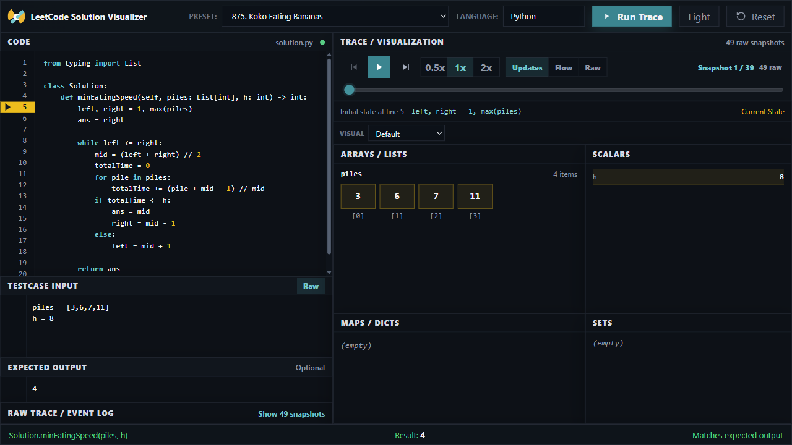

# LeetCode Solution Visualizer

LeetCode Solution Visualizer is a browser-based tool for understanding how Python solutions change state while they run. It is built for learners who want to inspect variables and data structures directly instead of reading a long raw execution log or relying on generated explanations.



## Why This Exists

LeetCode solutions often look short, but the hard part is mentally simulating what happens across loops, conditionals, recursive calls, stacks, pointers, and mutable data structures. This app turns that execution into a step-by-step visual trace so users can see what changed, when it changed, and which line caused it.

## What It Does

- Runs Python `Solution` methods or top-level functions against LeetCode-style testcase input.
- Executes the deterministic trace runner in the browser with Pyodide, so no backend server is required.
- Captures meaningful snapshots and shows arrays, linked lists, trees, maps, sets, scalars, return values, and changed variables.
- Provides `Updates`, `Flow`, and `Raw` trace modes so users can reduce noise or inspect every executed line.
- Includes guided visual modes for pointers, sliding windows, trees, graphs, and DP tables when the user selects the matching problem type.
- Offers problem presets, syntax highlighting, error-line highlighting, keyboard shortcuts, and dark/light themes.

## GitHub Pages Deployment

This app is ready for static hosting. The browser downloads Pyodide, loads `python_trace_runner.py` as bundled source, and runs the trace locally in WebAssembly.

```powershell
npm install
npm run build
```

The static site is generated in `dist/`. A GitHub Actions workflow is included at `.github/workflows/pages.yml`; enable GitHub Pages with **Source: GitHub Actions** and pushes to `main` or `master` will publish the app.

## Local Development

```powershell
npm install
npm run dev
```

Open the Vite URL printed in the terminal. The first trace run may take longer because Pyodide is downloaded and initialized in the browser.

## Shortcuts

- `Ctrl+Enter` or `Cmd+Enter`: run trace
- `ArrowRight`: next visible snapshot
- `ArrowLeft`: previous visible snapshot

## Supported Inputs

Use named LeetCode-style values:

```text
piles = [3,6,7,11]
h = 8
```

Or raw positional values:

```text
[3,6,7,11]
8
```

The runner includes basic LeetCode harness conversion for `ListNode`, `TreeNode`, and linked-list cycle `pos`.

## Current Limits

- Python execution depends on Pyodide loading from the CDN.
- Design-problem operation arrays such as `["MinStack","push","getMin"]` are not handled yet.
- Interactive helper APIs such as `guess`, `isBadVersion`, `Robot`, or `Master` are not implemented.
- Automatic LeetCode problem fetching is not included.
